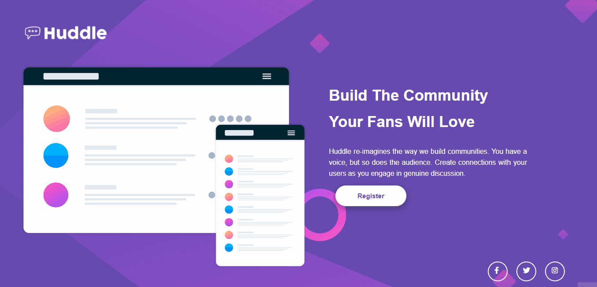
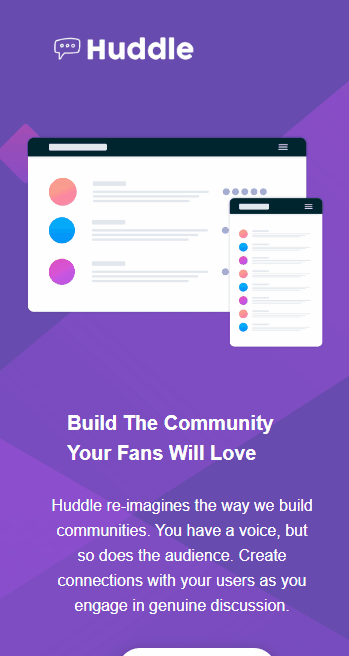

# Huddle Landing Page

Me desafiei a, não apenas completar o desafio "Huddle Landing Page" do Front-End Mentor, mas também a fazê-lo no menor tempo possível. Em 1h45min, desenvolvi uma landing page de seção introdutória única.

## O Desafio 💪

Criar a landing page de seção introdutória única da Huddle, apenas com as images usadas e as imagens da versão final no desktop e mobile.

*Versão desktop Front-End Mentor:*

*Versão mobile Front-End Mentor:*

## A minha página em funcionamento 😎

*Versão desktop:*

*Versão mobile:*

## Tecnologias usadas 🤓

- HTML5
- CSS3
- Clean Code
- Tags Semânticas
- Acessibilidade
- Flexbox
- CSS Grid

## Dificuldades 🥵

Encontrei as maiores dificuldades em momentos de incerteza entre quais propriedades usar, mas consegui resolver sem muito problema ao consultar as minhas anotações. Para evitar possíveis frustrações, eu pausei o meu trabalho por alguns momentos para então retormá-lo, de maneira mais clara e calma.

## O que eu aprendi 👩‍🎓

Com o objetivo de simular uma experiência o mais próxima do mundo real, eu procurei encontrar o ponto de intercessão entre a insistência e o pedir ajuda (ao Google, no caso), em busca de eficiência, mas sem sacrificar a proatividade e acertos-erros.

## Continuação e Desenvolvimento 👩‍🏫

Como essa foi a minha primeira vez construindo um projeto completo usando Flex e Grid, ainda quero me aprofundar muito nessas propriedades para que eu possa desenvolver projetos melhores.